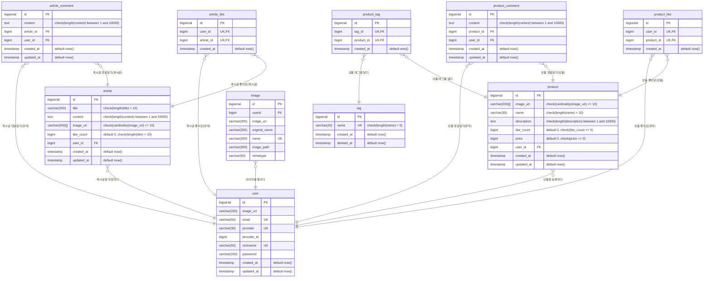

```mermaid
erDiagram
    user {
        bigserial id PK
        varchar(200) image_url
        varchar(50) email UK
        varchar(30) provider UK
        bigint provider_id
        varchar(50) nickname UK
        varchar(200) password
        timestamp created_at "default now()"
        timestamp updated_at "default now()"
    }

    article {
        bigserial id PK
        varchar(200) title "check(length(title) < 10)"
        text content "check(length(content) between 1 and 20000)"
        varchar(200)[] image_url "check(cardinality(image_url) <= 10)"
        bigint like_count "default 0, check(length(title) < 10)"
        bigint user_id FK
        timestamp created_at "default now()"
        timestamp updated_at "default now()"
    }

    article }o--|| user: "게시글을 작성하다"

    article_comment {
        bigserial id PK
        text content "check(length(content) between 1 and 10000)"
        bigint article_id FK
        bigint user_id FK
        timestamp created_at "default now()"
        timestamp updated_at "default now()"
    }

    article_comment }o--|| user: "게시글 댓글달기(유저)"
    article_comment }o--|| article : "게시글 댓글달기(게시글)"

    article_like {
        bigserial id PK
        bigint user_id UK,FK
        bigint article_id UK,FK
        timestamp created_at "default now()"
    }

    article_like }o--|| user: "게시글 좋아요(유저)"
    article_like }o--|| article : "게시글 좋아요(게시글)"

    product {
        bigserial id PK
        varchar(200)[] image_url "check(cardinality(image_url) <= 10)"
        varchar(30) name "check(length(name) < 10)"
        text description "check(length(description) between 1 and 10000)"
        bigint like_count "default 0, check(like_count >= 0)"
        bigint price "default 0, check(price >= 0)"
        bigint user_id FK
        timestamp created_at "default now()"
        timestamp updated_at "default now()"
    }

    product }o--|| user: "상품을 등록하다"

    product_comment {
        bigserial id PK
        text content "check(length(content) between 1 and 10000)"
        bigint product_id FK
        bigint user_id FK
        timestamp created_at "default now()"
        timestamp updated_at "default now()"
    }

    product_comment }o--|| user:"상품 댓글달기(유저)"
    product_comment }o--|| product : "상품 댓글달기(상품)"

    product_like {
        bigserial id PK
        bigint user_id UK,FK
        bigint product_id UK,FK
        timestamp created_at "default now()"
    }

    product_like }o--|| user: "상품 좋아요(유저)"
    product_like }o--|| product: "상품 좋아요(상품)"

    tag {
        bigserial id PK
        varchar(20) name UK "check(length(name) < 5)"
        timestamp created_at "default now()"
        timestamp deleted_at "default now()"
    }

    product_tag {
        bigserial id PK
        bigint tag_id UK,FK
        bigint product_id UK,FK
        timestamp created_at "default now()"
    }

    product_tag }o--|| tag :"상품 태그를 달다."
    product_tag }o--|| product: "상품 태그를 달다."

    image {
        bigserial id PK
        bigint userid FK
        varchar(200) image_url
        varchar(200) original_name
        varchar(200) name UK
        varchar(200) image_path
        varchar(50) mimetype
    }

    image }o--|| user: "이미지를 올리다"
```